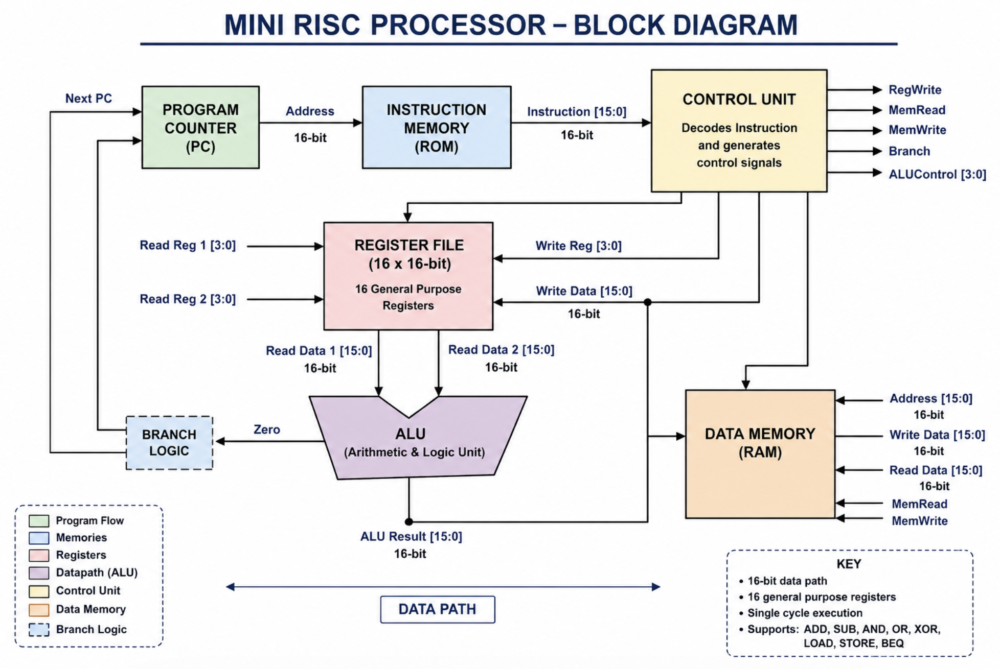
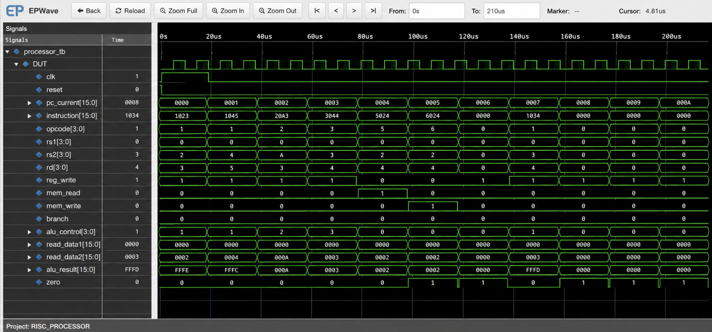

# Mini RISC Processor in Verilog

## Overview

This project implements a 16-bit Mini RISC Processor using Verilog HDL. The processor follows a single-cycle architecture and includes major CPU building blocks such as a Program Counter, Instruction Memory, Control Unit, Register File, ALU, and Data Memory.

The project demonstrates RTL design, instruction decoding, datapath implementation, and processor verification using simulation waveforms.

---

## Architecture

### Block Diagram

---

## Processor Datapath

The processor consists of:

* Program Counter (PC)
* Instruction Memory
* Control Unit
* Register File (16 × 16-bit)
* Arithmetic Logic Unit (ALU)
* Data Memory

Instruction flow:

PC → Instruction Memory → Control Unit → Register File → ALU → Data Memory

---

## Supported Instructions

| Opcode | Instruction |
| ------ | ----------- |
| 0000   | ADD         |
| 0001   | SUB         |
| 0010   | AND         |
| 0011   | OR          |
| 0100   | XOR         |
| 0101   | LOAD        |
| 0110   | STORE       |
| 0111   | BEQ         |

---

## Project Structure

mini-risc-processor/

├── src/

│   ├── alu.v

│   ├── pc.v

│   ├── register_file.v

│   ├── instruction_memory.v

│   ├── data_memory.v

│   ├── control_unit.v

│   └── processor_top.v

│

├── tb/

│   └── processor_tb.v

│

├── waveform/

│   └── processor_waveform.png

│

├── block_diagram/

│   └── processor_block_diagram.png

│

├── README.md

└── .gitignore

---

## Simulation

Compile:

iverilog -o processor_sim src/*.v tb/processor_tb.v

Run:

vvp processor_sim

Generate Waveform:

gtkwave processor.vcd

---

## Verification

### Waveform Output

The waveform verifies:

* Program Counter operation
* Instruction fetch
* Instruction decoding
* ALU execution
* Register file access
* Control signal generation

---

## Features

* 16-bit processor architecture
* 16 general-purpose registers
* Arithmetic and logical operations
* Single-cycle execution
* Verilog RTL implementation
* Modular design approach
* Functional verification using testbench

---

## Tools Used

* Verilog HDL
* Icarus Verilog
* GTKWave
* VS Code
* Git
* GitHub

---

## Author

Ishita Chaudhary
